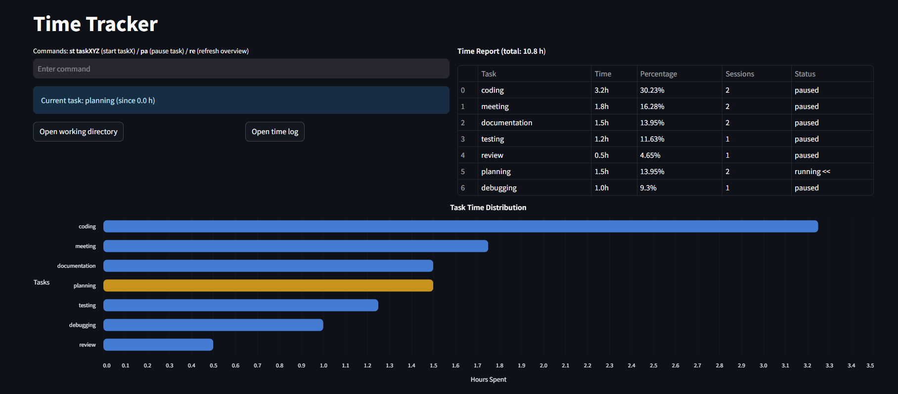

## Time Tracker
Time tracker is a simple Python app that allows you to track the time you spend on different tasks. It uses a CSV file to store task data, and provides a web-based interface built with Streamlit for starting and stopping tasks, as well as generating time reports.



## Installation
To install time tracker, you'll need to have Python 3 installed on your system. You can then install the required dependencies using pip:
```
pip install -r requirements.txt
```

You can also refer to the official Streamlit documentation for more detailed installation instructions: https://docs.streamlit.io/library/get-started.

## Usage
After installing the required dependencies, you can run the time tracker app using the following command.
To guarantee that your app is only accessible from your machine, run Streamlit with the --server.address option set to localhost:

```
streamlit run .\time_tracker.py --server.address localhost
```
- What this does: This command instructs Streamlit to listen only on the localhost interface, preventing any external devices from connecting, even if they have your IP address.
- Why it works: By binding to localhost, the server ignores requests from outside your computer.


Task data will be stored inside a CSV file which will be located in the same directory.
